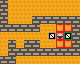

# Zlatko Framework

v0.0.5

## Description

Version du framework : 09/11/2018 22:00

Ce code source a pour but de fournir une base de code permettant de faire un jeu du type Sokoban. Il fournis des fonctionnalités tel que la gestion d'état du jeu, un système de menu, une gestion de meilleurs scores, etc. Pour voir toutes les possibilités du framework : reportez-vous à la documentation dont je fournis un sommaire ci-dessous.

### Qu'es-ce que le Sokoban ?

Le Sokoban est un jeu où nous incarnons un personnage qui se trouve dans un entrepôt. L'objectif est de déplacer des caisses sur des zones de chargements.

Voici une version du jeu que j'ai développé dans le cadre d'un tutoriel, sans utilisé ce framework (qui n'existait pas encore), mais je prévois d'écrire une version plus complète du jeu avec ce framework :

## Sommaire documentation

* [001 - Présentation du coeur du framework et de ses fonctionnalités](documentation/001_coeur_fonctionnalites.MD)
* [002 - Liste des codes d'erreurs](documentation/002_erreurs.MD)
* [099 - ZlatkoEngine](documentation/099_zlatko_engine.MD)
* [100 - Menu avec ZlatkoAbstractMenu et ZlatkoDefaultMenu](documentation/100_menu.MD)
* [101 - Gestionnaire d'états : ZlatkoStateManager](documentation/101_gestionnaire_etats.MD)
